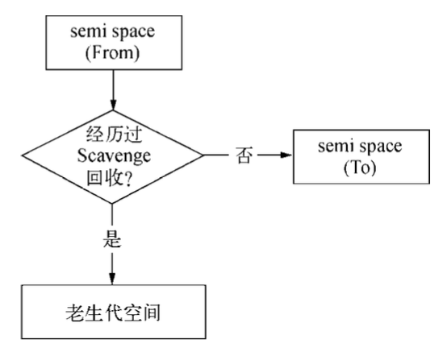

## 内存管理
这里主要以chromeV8为例，介绍一下垃圾回收算法。64位系统上chrome可以使用的空间是1.4GB，32位系统可以使用0.7GB。空间比较小，所以定期会进行垃圾回收。由于所有对象生存周期长短不一，所以对对象进行分类，不同类对象使用不同的回收算法。
### 分类
将内存分为**新生代**和**老生代**，新生代为存活时间很短的对象，老生代为存活时间较长或者常驻内存的对象，比如全局变量。新生代对象使用*Scavenge*算法进行垃圾回收，老生代对象使用*Mark-Sweep&Mark-Compact*的方式进行回收。64位系统给新生代对象分配了32MB空间，32位系统给新生代对象分配了16MB。
### Scavenge
Scavenge实际上是采用**复制**方式实现的。将内存一分为2，工作状态的视为From空间，闲置状态的视为To空间。

先在From空间给对象分配内存，等到垃圾回收阶段，会检查From空间存活对象，将这些对象复制到To空间，非存活对象占用的内存释放。这样To空间和From空间交换身份，To变成了From工作空间。
### Mark-Sweep&Mark-Compact
Mark-Sweep是标记清除，Mark-Compact是标记整理。
Mark-Sweep方法，标记阶段遍历所有的对象，给所有存活的变量都打上标记，清除阶段清除所有没有被标记的对象。

怎么判断一个对象是否存活呢？

所有的全局变量，以及全局变量指向的变量，再加上这些变量能够访问到的变量，组成了一棵树。所有可以到达的变量，都视为存活对象；当前执行上下文的作用域链中的所有对象，也视为存活对象。

标记清除之后会造成内存空间不连续，所以提出了标记整理的方法，整理阶段碰到死亡对象，会将活着的对象往一端移动，直接清理掉边界外的内存。

大部分的浏览器IE、Firefox、Opera、Chrome和Safari都是采用的这种垃圾回收策略。

### 新生代对象转化为老生代对象
每次垃圾回收时，如果一个新生代对象已经经历过Scavenge回收或者To空间的占比已经超过了25%，那么新生代对象会被移动到老生区。
## 内存泄漏
### 引用计数
一种不常见的垃圾回收策略叫做引用计数，如果有一个引用指向这个对象，那么这个对象的引用计数就增加1，如果这个引用指向了别的对象或者被改写，引用计数就减少1。引用次数为0的“对象”会被释放。

### 引发的问题

引用计数不能识别循环引用

	function problem() {
		var o1 = new Object();
		var o2 = new Object();
		o1.someObject = o2;
		o2.someObject = o1;
	}
	problem();
函数调用完毕后，引用计数依旧不为0，如果这个函数被多次调用，就会导致大量的内存不被释放。

IE中有一部分对象不是原生JS对象，其中BOM和DOM对象就是使用C++以COM对象的形式实现的，COM对象垃圾回收机制就是引用计数。即使IE的js引擎使用标记清除策略，COM对象依旧是基于引用计数策略，所以依旧存在循环引用的问题

	var element = document.getElementById('some_element');
	var myObject = new Object();
	myObject.element = element;
	element.someObject = myObject;
### IE下其它性能问题
垃圾回收是周期进行的。老版本IE是根据内存分配量运行的，具体就是256个变量、4096个对象(包括数组)、64KB的字符串。达到这些任何一个临界值，垃圾回收器会运行，也就是说如果一个应用长期需要这么多的内存，就会导致垃圾回收历程频繁运行。

从IE7开始，初始临界值不变，如果回收的内存分配量少于15%，则临界值加倍，如果超过85%，临界值会重置。